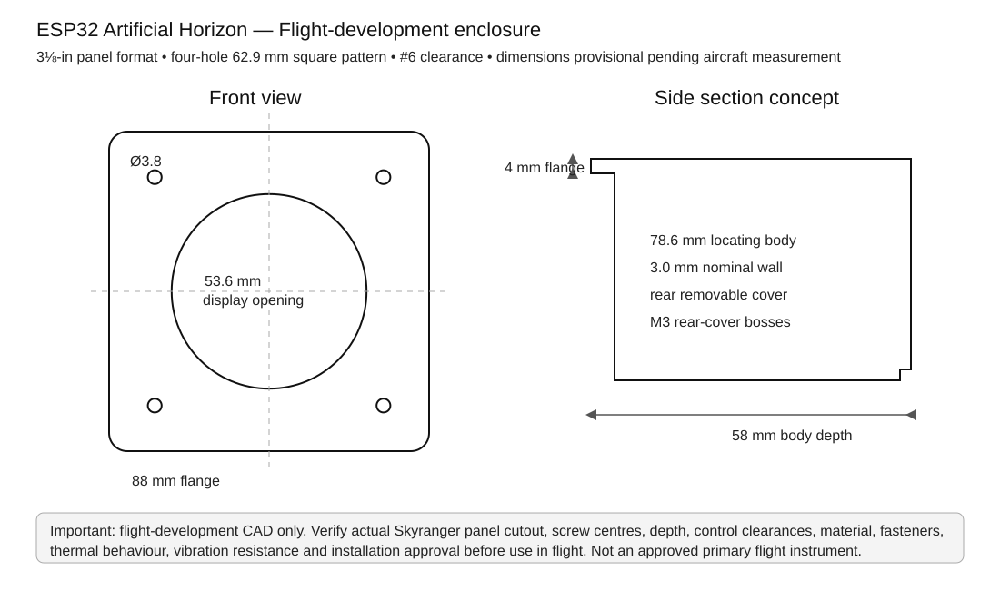

# Flight-development enclosure

This document records the current 3D-printable enclosure design for the ESP32 artificial-horizon project.

> **Status:** flight-development prototype only. This enclosure is not certified, approved or qualified as a primary flight-instrument housing. Geometry, materials, fasteners, vibration resistance, thermal performance and aircraft installation must be verified before flight use.

## Current mechanical configuration

The enclosure targets the conventional 3 1/8-inch aircraft-instrument format and currently provides:

- 80.30 mm reference panel opening
- 79.60 mm cylindrical locating body
- 88 × 88 mm rounded front flange
- 58 mm body depth
- 3 mm nominal structural wall
- 53.6 mm display aperture and Newhaven-specific display pocket
- four-hole 62.9 × 62.9 mm standard instrument mounting pattern
- 4.4 mm front panel mounting holes
- removable spigoted rear cover
- internal rear-cover screw bosses
- rear USB/cable opening
- **four reinforced rear recesses for M5 brass threaded inserts**

## M5 brass threaded insert mounting

The latest CAD adds a reinforced boss and brass-insert recess at each of the four standard mounting positions on the **back of the enclosure**. These are intended to accept brass threaded inserts with an **M5 internal thread**, allowing M5 cap-head machine screws to engage a retained metal thread rather than repeatedly loading printed polymer threads.

Current parametric starting dimensions are:

| Feature | Value | Status |
|---|---:|---|
| M5 insert boss outside diameter | 12.0 mm | Development value |
| M5 insert boss depth | 10.0 mm | Development value |
| Insert recess diameter | 7.2 mm | **Must be matched to purchased insert** |
| Insert recess depth | 8.0 mm | **Must be matched to purchased insert** |
| M5 screw clearance below insert | 5.5 mm | Development value |
| Insert positions | 62.9 × 62.9 mm square | Same centres as front mounting pattern |

The 7.2 × 8.0 mm recess is intentionally treated as a **placeholder for the physical insert**, not as a universal M5 heat-set-insert standard. Brass M5 inserts are sold in several outside diameters, lengths, knurl forms and installation styles. Before the final print, measure the selected insert or use its manufacturer's recommended CAD hole diameter and depth.

### Preferred installation practice

For the flight-development article:

1. Use a known-brand brass threaded insert intended for the chosen print material.
2. Print a small test coupon containing several candidate recess diameters before committing to the complete enclosure.
3. Install heat-set inserts with a temperature-controlled insert tool rather than an uncontrolled soldering-iron tip where practical.
4. Ensure the insert sits square to the screw axis and below/flush with the rear reference face as intended.
5. Do not overheat ASA/ABS around the boss; reject any boss showing distortion, cracking or poor layer bonding.
6. Use an M5 cap-head machine screw of a length that provides useful thread engagement without bottoming in the insert or contacting internal electronics.
7. Use an appropriate locking method for the aircraft installation rather than relying solely on screw friction.
8. Re-check insert retention after thermal and vibration testing.

The brass insert improves serviceability and thread durability, but it does **not** by itself qualify a printed mounting boss as an aircraft structural attachment.

## Standard panel geometry

| Feature | Current value |
|---|---:|
| Reference panel opening | 80.30 mm |
| Enclosure locating-body diameter | 79.60 mm |
| Front flange | 88 × 88 mm |
| Front flange thickness | 4.0 mm |
| Main body depth | 58.0 mm |
| Panel mounting-hole pattern | 62.9 × 62.9 mm square |
| Front mounting holes | 4.4 mm diameter |
| Nominal wall thickness | 3.0 mm |

The actual Skyranger panel dimensions remain controlling. Measure the opening, all four mounting-hole centres, panel thickness and available rear depth before freezing the installation geometry.

## CAD and generated files

Parametric source:

- `enclosure/source/ESP32_Artificial_Horizon_Flight_Development_Case.scad`

Preview:

- `enclosure/images/flight-development-case-preview.svg`

Generated STL targets:

- `enclosure/stl/ESP32_Artificial_Horizon_Flight_Development_Body.stl`
- `enclosure/stl/ESP32_Artificial_Horizon_Flight_Development_Rear_Cover.stl`

The repository workflow regenerates the STL geometry from the OpenSCAD source when the source changes.

## Material recommendation

Do not use ordinary PLA for cockpit development. Evaluate ASA, ABS or a suitable engineering filament supported by the printer. A useful initial print setup is 0.2 mm layers or finer, at least four perimeters, at least five top/bottom layers and approximately 35–50% infill, followed by inspection and mechanical testing.

## Internal hardware still to be added

The next CAD revision should provide positive retention for:

- ESP32-S3-DevKitC-1-N8R2
- Bosch BMI088 Shuttle Board 3.0 on a rigid, axis-defined carrier
- TPS61169 backlight board
- MCP23008 prototype hardware
- display/FFC arrangement
- rotary encoder
- USB-C strain relief
- internal wiring/tie points

No flight-development article should contain loose modules, unsupported connectors or Dupont wiring.

## Flight-development verification

Before aircraft use, verify at minimum:

- actual panel opening and four screw centres
- free insertion/removal without enclosure stress
- M5 insert dimensions against the purchased hardware
- insert pull-out and torque behaviour on representative printed coupons
- correct cap-head screw length and engagement
- no interference between M5 screws/bosses and electronics
- display and FFC retention
- rigid IMU alignment
- maximum-brightness thermal soak
- powered vibration test
- post-vibration insert torque/retention inspection
- cable strain relief and chafe protection
- full aircraft-control clearance
- unmistakable `ATTITUDE INVALID` behaviour on sensor/AHRS failure
- applicable installation/approval route

Until these checks and the remaining internal mounts are completed, this remains a **flight-development enclosure**, not a certified or approved primary flight-instrument housing.
